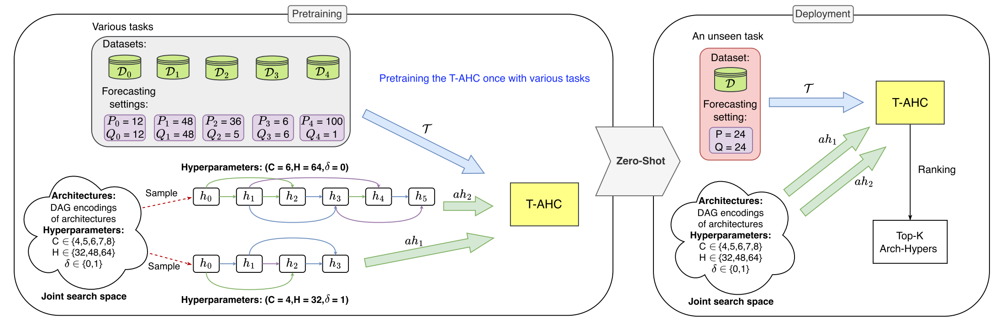

# AutoCTS++: Zero-shot Joint Neural Architecture and Hyperparameter Search for Correlated Time Series Forecasting

## Introduction

 **AutoCTS++**, a zero-shot, joint search framework, to efficiently configure effective CTS forecasting models (including both neural architectures and hyperparameters), even when facing unseen datasets and foreacsting settings. Specifically, we propose an architecture-hyperparameter joint search space by encoding candidate architecture and accompanying hyperparameters into a graph representation. We then introduce a zero-shot Task-aware Architecture-Hyperparameter Comparator (T-AHC) to rank architecture-hyperparameter pairs according to different tasks.  A final forecasting model is then selected from the top-ranked pairs. 

<div align="center">

</div>


## Structure

- AHC/ Store the network structure of AHC and the trained parameters of AHC.
- data/ Store the dataset.
- subsets/ Store the subsets of data used for pre-training.
- seeds/ Store the collected seeds.
- task_feature/ Store the extracted task features for pre-training T-AHC.
- exps/ Store experimental scripts for various tests.
  - generate_seeds.py is used to generate seeds for training and end-to-end testing (training the searched model).
  - random_search.py is used for pre-training T-AHC and for zero-shot inference using T-AHC.
  - generate_task_feature.py uses TS2Vec to encode tasks and generate task features.
  - dataset_slice.py slices the original dataset based on heuristic rules to generate subsets.
- NAS_Net/ Store the neural network structure of AutoCTS++ NAS.
  - AHC/AHC_param/ Store the pre-trained parameters of T-AHC.
  - AHC/set_encoder/ Store the architecture files related to set_transformer.
  - AHC/ahc_engine.py The main structure of T-AHC.
  - Ts2vec_model, stores the main code files of TS2Vec.
  - operations.py Stores the basic operators of NAS.
  - st_net.py Stores the main backbone of the model.
- scripts/ Store automated testing scripts.
- utils Store some utility scripts.


## Quick Start

### Generate subsets & task features

```shell
bash ./scripts/slice_dataset.sh
bash ./scripts/generate_all_task_feature.sh
bash ./scripts/generate_task_feature_for_subsets
```


### Pretrain

```shell
export PYTHONPATH=../
export CUDA_VISIBLE_DEVICES=0
id=0
loader=linear

python ../exps/random_search.py --mode pretrain --exp_id $id --loader_mode $linear
```


### Zero-shot search

```shell
export PYTHONPATH=../
export CUDA_VISIBLE_DEVICES=0
sample_scale=300000
seq_len=12
id=0

python ../exps/generate_task_feature.py --dataset PEMS-BAY/pems-bay $date --loader h5 --repr_dims $repr_dims --seq_len $seq_len --sample_num $sample_num --epochs $epochs --ratio 0.7 0.1 0.2

python ../exps/random_search.py   --dataset PEMS-BAY/pems-bay --mode search --exp_id $id --sample_scale $sample_scale --seq_len $seq_len

python ../exps/generate_seeds.py  --dataset PEMS-BAY/pems-bay --datatype h5 --in_dim 1 --num_nodes 325 --seq_len $seq_len --mode train --epochs 100  --exp_id $id --ratio 0.7 0.1 0.2
```

